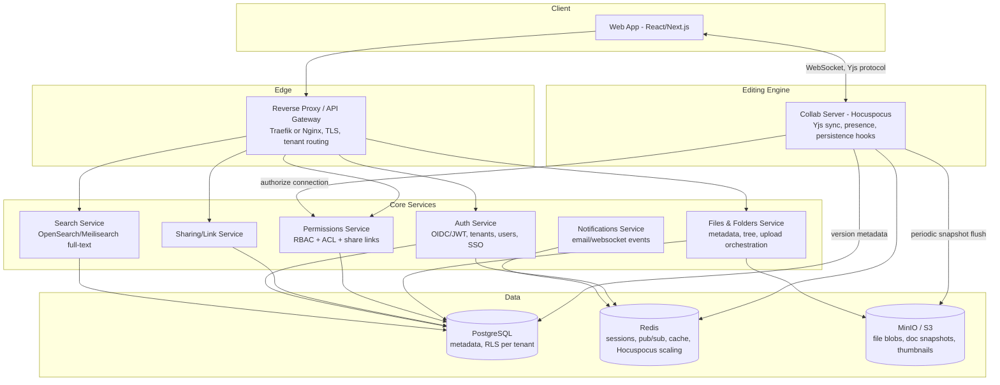

# WebOffice — Cloud-Native, Multi-Tenant Office Suite

A Google-Docs-style product: real-time collaborative documents, file storage, sharing links, and per-file permissions (owner / editor / commenter / viewer), fully Docker-deployable, multi-tenant from day one, built to enterprise-customer standards (SSO/SCIM, high availability, key management, compliance-grade audit, and formal SLOs) rather than stopping at a self-hosted MVP.

### Enterprise readiness at a glance

| Concern | Section | MVP status |
|---|---|---|
| RBAC + audit logging | §5, §10 | Designed — foundational, built first per the standard enterprise-SaaS build order (RBAC → audit → SSO → SCIM) |
| SSO (SAML/OIDC), SCIM provisioning, MFA | §28 | Designed |
| Groups / org structure for sharing | §4, §28 | Designed |
| High availability (Postgres, MinIO, Redis, Collab Server) | §29 | Designed |
| Secrets & encryption key management (incl. customer-managed keys) | §30 | Designed |
| Compliance-grade audit integrity, data residency, legal hold | §31 | Designed |
| Enterprise admin policy engine (enforce-SSO, disable external sharing, IP allowlist) | §32 | Designed |
| SLOs/SLAs & incident management | §33 | Designed |
| Secure SDLC, IaC, release engineering, dependency/vuln scanning | §34 | Designed |
| Comment notifications, version diffing, presence-outside-editor, gateway rate limiting, GDPR/DPA workflow, accessibility/i18n | §15 | Explicitly deferred, not silently dropped |

This table is the executive-summary layer; each row's section has the actual design.

## 1. Answering the core question: do you need a filesystem?

No — not a POSIX filesystem, and not a single shared disk. You need three separate layers, each doing one job:

| Layer | Stores | Technology |
|---|---|---|
| **Object storage** | The actual bytes: uploaded files, exported PDFs/DOCX snapshots, thumbnails, periodic CRDT document snapshots | MinIO (S3-compatible, self-hostable, Docker image) |
| **Metadata DB** | Tenants, users, folders, file records, permissions, share links, versions, audit log | PostgreSQL |
| **Live document state** | The in-progress, actively-edited content of a doc that hasn't been "saved" as a blob yet | CRDT doc server (Yjs/Hocuspocus) with Redis for pub/sub across replicas |

Your app exposes a **virtual filesystem** (folders/files, drag-drop, breadcrumbs) purely as a UI/API abstraction over Postgres rows + S3 objects — never a real mounted disk. This is exactly the pattern used by modern self-hosted Drive clones like Nimbus (S3 for blobs + Postgres for relations + cache for metadata) and SafeBucket (presigned URLs direct to S3, API only handles metadata/ACL/audit). It's also what gives you multi-tenancy, horizontal scaling, and backup/restore for free — a disk-based filesystem gives you none of that.

### On-prem / air-gapped note on MinIO

MinIO doesn't require any cloud account or external S3 endpoint — for an isolated on-prem deployment:
- **Single-node/single-drive mode**: one `minio` container with its data directory on a named Docker volume (`docker volume create weboffice-minio-data`) or a bind mount to a host path (`/srv/weboffice/minio-data:/data`). This is enough for a single-box, fully offline install.
- **Single-node/multi-drive (erasure-coded) mode**: mount several disks/volumes on that same host (`/data1 … /data4`) to MinIO for bitrot protection and drive-failure tolerance without needing a second server — still one container, one docker-compose stack.
- Either way it's the same `minio/minio` image and the same S3 API your app code talks to; only the volume/mount config changes between "dev laptop," "single on-prem box," and "cloud with real S3." Back up the volume like any other stateful volume (snapshot the underlying disk, or `mc mirror` to a second MinIO for offsite replication).

## 2. Editing engine: Option B — build your own collaborative editor (chosen)

Decision made: build the editor rather than embed Collabora/ONLYOFFICE. This buys full control of the format, the collaboration protocol, and the on-prem story (no third-party office-engine container, no per-seat/connection licensing limits to worry about in an isolated deployment) — at the cost of building the editing experience yourselves instead of getting it for free.

Stack: **Yjs** as the CRDT data model, **Tiptap/ProseMirror** as the editor UI, **Hocuspocus** (Tiptap team's Yjs server) for sync/persistence/presence, **Redis** for pub/sub so multiple Hocuspocus replicas stay consistent, and periodic snapshots of the Yjs doc flushed into Postgres/S3 for versioning and cold storage.

Scope reality check, so the roadmap accounts for it honestly:
- **Rich-text documents** (the actual "Docs" of this suite) are the tractable target — Tiptap/ProseMirror + Yjs is a mature, well-trodden combination for this.
- **Spreadsheets and slides** are a materially bigger lift if built the same way — CRDT-grade collab for grids/formulas (e.g. via Univer or Luckysheet) is far less mature than rich-text CRDT tooling. Treat "Docs" as the MVP surface and revisit Sheets/Slides as a distinct, later effort rather than assuming they fall out of the same editor stack.
- Import/export to real Office formats (.docx/.xlsx/.pptx) is *not* free with this approach — budget separate work for a conversion path (e.g. a headless LibreOffice/`unoconv` conversion service invoked on demand for export/import) if users need to interoperate with Word/Excel files.

(Kept for reference, not the current plan: embedding Collabora Online or ONLYOFFICE Document Server via the WOPI protocol was the alternative considered — it gets real docs/sheets/slides with Office-format fidelity fastest, at the cost of depending on a third-party engine. Revisit this only if the custom-editor build stalls or format fidelity becomes a blocker.)

## 3. High-level architecture



All boxes under "Core Services" and "Editing Engine" are separate containers in `docker-compose.yml`; each is independently scalable and replaceable. The browser talks to the Collab Server directly over WebSocket for live editing, and to the REST services (Files/Permissions/Sharing) for everything else (tree browsing, uploads, share-link management).

## 4. Data model (metadata DB, Postgres)

Core tables — every tenant-scoped table carries `tenant_id` and is protected by a Postgres Row-Level Security policy (`USING (tenant_id = current_setting('app.tenant_id')::uuid)`), set per-connection at the start of each request. This is the recommended 2026 default for B2B SaaS: single database, single schema, RLS enforced at the database layer so tenant isolation can't be forgotten in application code, with schema-per-tenant or DB-per-tenant reserved for the rare very-large or high-compliance tenant you outgrow the shared model for.

```
tenants(id, name, plan, storage_quota_bytes, created_at)
users(id, email UNIQUE, display_name, password_hash|sso_subject, sso_provider nullable,
      mfa_enrolled boolean default false, created_at)
                                                -- GLOBAL identity, no tenant_id — a user must be
                                                -- able to belong to >1 tenant and hold resource-
                                                -- level access in a tenant they're not a member of,
                                                -- or cross-tenant sharing (§6) is impossible
memberships(user_id, tenant_id, role)          -- tenant-level role: owner/admin/member; the only
                                                -- place "which tenant(s) does this user belong to"
                                                -- is recorded
groups(id, tenant_id, name, source[native|scim], external_id nullable, created_at)
                                                -- org structure for sharing at group granularity
                                                -- ("share with Engineering", not five individual
                                                -- grants); `source`/`external_id` let SCIM (§28)
                                                -- own a group's membership when synced from an IdP
group_memberships(group_id, user_id)
invites(id, email, resource_type[file|folder|tenant], resource_id nullable, role,
        invited_by, tenant_id, token, accepted_user_id nullable, expires_at, created_at)
                                                -- pending invite to an email with no account yet,
                                                -- or to an existing user outside this tenant;
                                                -- accepting creates/links a `users` row and a
                                                -- `permissions` (or `memberships`) row
tenant_policies(tenant_id PK, enforce_sso boolean default false,
                allow_external_sharing boolean default true, mfa_required boolean default false,
                ip_allowlist jsonb nullable, session_timeout_minutes integer default 480,
                data_residency_region, updated_at)
                                                -- per-tenant admin policy row read by the gateway,
                                                -- auth service and Permissions Service — see §32
folders(id, tenant_id, parent_id, name, owner_id, version integer default 1,
        created_at, updated_at, deleted_at)
files(id, tenant_id, folder_id, name, mime_type, size_bytes, owner_id,
      s3_key, current_version_id, version integer default 1,
      created_at, updated_at, deleted_at)     -- `version` is an optimistic-concurrency counter for
                                                -- metadata edits (rename/move), unrelated to
                                                -- `file_versions`/content history below — see §18
file_versions(id, file_id, s3_key, size_bytes, created_by, created_at, label)
doc_snapshots(id, file_id, yjs_state_s3_key, size_bytes, created_at)
                                                -- periodic binary flush of the live Yjs doc; a
                                                -- doc_snapshot becomes a file_version at explicit
                                                -- "save"/checkpoint points
doc_assets(id, tenant_id, file_id, s3_key, mime_type, size_bytes,
           uploaded_by, created_at)            -- images/media embedded inside a doc's content,
                                                -- referenced by id from the Yjs/Tiptap doc body
                                                -- (see §14) — never stored inline in the CRDT state
permissions(id, resource_type[file|folder], resource_id, subject_type[user|group|link],
            subject_id, role[viewer|commenter|editor|owner], inherited boolean)
share_links(id, resource_type, resource_id, token, role[viewer|editor],
            password_hash nullable, expires_at nullable, created_by, created_at)
audit_log(id, tenant_id, actor_id, action, resource_type, resource_id, meta jsonb, created_at)
```

Permission resolution order for a request: explicit user grant on the file → explicit grant inherited from parent folder → tenant-level default → share-link token (if accessed anonymously/externally) → deny.

Because `users` is now a global identity (no `tenant_id`), a `permissions` row can grant a role to a user who has **no** `memberships` row in the file's owning tenant at all — that's what makes cross-tenant/external sharing representable: "share this doc with someone@othercompany.com" creates a `permissions` grant (and an `invites` row if that email has no `users` row yet) without ever making them a member of your tenant. RLS on `permissions`/`files`/`folders` still scopes by the *resource's* `tenant_id`; RLS does not apply to the global `users` table itself — a user's own row should only be reachable through a join via `memberships` or `permissions`, never listed by tenant directly.

A `permissions` row with `subject_type = group` resolves through `group_memberships` at check time (a user's effective role on a resource is the highest role granted directly, via any group they belong to, or inherited from a parent folder) — this is what lets an admin share a folder with "Engineering" once instead of granting each engineer individually, and have new hires who join that group in the IdP (via SCIM, §28) inherit access automatically without a second sharing action.

## 5. Permission model in practice

Four roles, same as Google Docs, applied uniformly to files, folders (inherited), and links:

- **Owner** — full control incl. deleting, re-sharing, transferring ownership.
- **Editor** — read/write content, cannot manage permissions.
- **Commenter** — read + add comments/suggestions, cannot change content directly.
- **Viewer** — read-only, no comments.

Implementation notes:
- Enforce at three layers, not one: (1) DB-level RLS as the floor, (2) Permissions Service as the source of truth for role checks, (3) the Collab Server (Hocuspocus) resolves the caller's role in its `onAuthenticate` hook on every WebSocket connection and marks the connection read-only (rejects incoming Yjs updates, still relays awareness/cursor state) for viewers/commenters — this is what actually makes the editor read-only vs editable in the browser. This only covers the *start* of a session — see §16 for what happens when a grant is revoked while someone is actively connected.
- Folder permissions cascade down by default; allow per-file overrides (like Drive) but keep the override table small and explicit (`inherited=false` rows only).
- Share links carry their own role and optional password/expiry; anonymous access resolves through the link token, not a user session.
- Use a policy library (e.g., Casbin, or hand-rolled since the role set is small and fixed) rather than scattering `if role == 'editor'` checks through the codebase.
- Grants can target a `user`, a `group`, or a `link` (§4) — resolve all three through the same policy library rather than special-casing group membership in application code, so a future custom-roles feature (some enterprise buyers ask for roles beyond the fixed four) is a policy-table change, not a rewrite of every permission check.

## 6. Multi-tenancy strategy

- **Tenant identification**: subdomain (`acme.weboffice.app`) or a header/claim in the JWT — resolved at the gateway and injected as `tenant_id` into every downstream request context.
- **Data isolation**: shared Postgres + RLS (see §4) for cost efficiency at low/medium tenant counts; shared MinIO bucket with tenant-prefixed keys (`s3://weboffice/{tenant_id}/{file_id}/{version}`) so a bucket-policy mistake can't leak across tenants even without relying on the app layer. For a fully isolated on-prem customer, the same tenant-prefix scheme still applies inside their single dedicated MinIO instance — see the on-prem note in §1.
- **Collab-session isolation**: Hocuspocus document names are namespaced as `{tenant_id}:{file_id}` so a Redis pub/sub channel or an in-memory doc instance can never be addressed across tenants even if a client guessed another file's UUID.
- **Noisy-neighbor control**: per-tenant storage quota (enforced in Files Service before upload) and per-tenant rate limits at the gateway.
- **Escape hatch**: design the Files/Permissions services to take a `tenant_id` → connection-string lookup, so a specific large or regulated tenant can be moved to a dedicated Postgres/S3 later without a rewrite.
- **Cross-tenant sharing**: because `users` is a global identity and `permissions.subject_id` can reference any user regardless of tenant membership (§4), "share with anyone" works the same as Google Docs — the file stays in the owning tenant's Postgres rows/S3 prefix, and the invited user's client simply requests it through a permission check that no longer requires same-tenant membership. A tenant admin who wants to *forbid* this (common enterprise ask, mirrors Google Workspace's "external sharing" toggle) sets `tenant_policies.allow_external_sharing = false` (§4/§32); the Permissions Service checks it at grant-creation time, not as a hardcoded rule.
- **Data residency**: `tenant_policies.data_residency_region` (§4) lets a regulated tenant pin where its Postgres/MinIO data physically lives once the deployment is multi-region (§29) — this is a placeholder in a single-region deployment, but the column should exist from the start so a later region-pinning feature is a migration, not a schema redesign.

## 7. Real-time collaboration mechanics

Flow: Tiptap/ProseMirror in the browser ↔ Hocuspocus server (WebSocket, Yjs sync protocol) ↔ Redis (pub/sub so multiple Hocuspocus replicas stay in sync when a doc's editors are spread across pods) ↔ periodic flush of the Yjs document into Postgres/S3 as a snapshot for versioning and cold storage.

Concretely, per document session:
1. Client opens a WebSocket to the Collab Server for `docId = {tenant_id}:{file_id}`.
2. Hocuspocus `onAuthenticate` hook calls the Permissions Service with the caller's session token; resolves role → allows connection read-write (editor/owner), read-only (viewer/commenter, awareness only), or rejects.
3. `onLoadDocument` hook: if the doc isn't already live in memory, hydrate it from the latest `doc_snapshots` row in S3 (fall back to an empty doc for a brand-new file).
4. Live edits sync peer-to-peer through Hocuspocus/Yjs; Redis extension fans updates out across replicas so two users on different pods still see each other's keystrokes.
5. `onStoreDocument` hook (Hocuspocus's built-in debounce) periodically persists the current Yjs state to S3 as a new `doc_snapshots` row; an explicit user "save as version" action promotes a snapshot to a named `file_versions` row.
6. Presence/awareness (cursors, selected ranges, active-user avatars) rides the same WebSocket via Yjs's awareness protocol — no separate infra needed.
7. Comment threads can be modeled as a second Yjs shared type (`Y.Map` of comment nodes) on the same doc, or as a plain Postgres table keyed by an anchor position — start with Postgres; move to Yjs-native only if comment concurrency becomes an issue.
8. The browser also runs a `y-indexeddb` provider alongside the Hocuspocus WebSocket provider (see §24) so a dropped connection doesn't lose in-progress keystrokes, and the search-index extraction in §17 hooks into the same `onStoreDocument` callback as step 5.

This is entirely your own code — there's no third-party engine in the loop, which is also why the on-prem story is simple: the Collab Server is just another stateless-ish Node container, and its only dependencies are Redis (for horizontal scaling) and Postgres/MinIO (for persistence), all of which are already in your stack.

## 8. Suggested tech stack

- **Frontend**: React + Next.js (or Vite), Tailwind — file browser, share dialogs, permission UI, and the Tiptap editor component connected to Hocuspocus via `y-websocket`/`HocuspocusProvider`.
- **Collab Server**: Node.js/TypeScript running `@hocuspocus/server` — this piece is Node regardless of the rest of the stack, since Yjs/Hocuspocus is a JS/TS ecosystem.
- **Other backend services**: Node.js/TypeScript (NestJS) or Python (FastAPI) for Files/Permissions/Sharing/Auth REST APIs — pick whichever this team already runs day-to-day. Given the rest of this repo is Python/FastAPI-style (see `GNAgent`), FastAPI is the lower-friction choice for consistency; the Collab Server stays Node either way.
- **Auth**: Keycloak (OIDC, multi-tenant realms) — chosen over a custom JWT service specifically because it also gives you SAML/OIDC SSO federation and a SCIM-compatible provisioning path (§28) essentially for free; rolling your own auth service means rebuilding that surface later when the first enterprise customer asks for it.
- **Secrets/keys**: HashiCorp Vault (or cloud KMS in a managed deploy) — see §30.
- **DB**: PostgreSQL 16+ with RLS.
- **Cache/pubsub**: Redis (also used by Hocuspocus's Redis extension for cross-replica sync).
- **Object storage**: MinIO — Docker-volume-backed for on-prem/air-gapped (see §1), swappable for AWS S3 in cloud deploys with no app-code change (same S3 API).
- **Editing engine**: Tiptap/ProseMirror + Yjs, served by the Collab Server above (no third-party office engine).
- **Search**: Meilisearch (simplest to self-host) or OpenSearch if you need it at real scale.
- **Gateway**: Traefik (nice Docker-label-based routing, good fit for per-tenant subdomains) or Nginx.
- **Async/events**: Redis Streams or NATS for notification/audit fan-out (skip Kafka until scale actually demands it).

## 9. Docker Compose topology (dev / small self-host, single-node)

This topology is intentionally single-node — right for local dev, a demo, or a small on-prem/air-gapped install (§1) where one box's worth of availability is acceptable. It is **not** the enterprise/production topology: every service below is a single point of failure. See §29 for the multi-node, highly-available version of this same architecture (Patroni-managed Postgres, a 4+ node erasure-coded MinIO cluster, Redis Sentinel) — same containers, same app code, different node count and orchestration.

```
services:
  gateway:        traefik (routes by tenant subdomain, TLS termination)
  web:            frontend build, served behind gateway
  auth:           keycloak (or custom auth-service)
  api-files:      FastAPI service — folders/files/upload orchestration
  api-permissions: FastAPI service — roles/ACL/share-links
  collab-server:  Node.js — @hocuspocus/server, Yjs sync/persistence/awareness
  postgres:       postgres:16
  redis:          redis:7
  minio:          minio/minio          # volumes: - minio-data:/data (named volume or host bind mount)
  meilisearch:    getmeili/meilisearch

volumes:
  minio-data:      # on a bind mount instead for on-prem: "/srv/weboffice/minio-data:/data"
  pg-data:
```
Each backend service is a separate container so any one of them can scale independently or be swapped later; `docker-compose.yml` for dev, Helm chart / Kubernetes manifests for production once you need multi-node scaling and rolling deploys. For a single-box on-prem/air-gapped install, this same compose file *is* the production deployment — just point `minio-data` and `pg-data` at bind-mounted paths on properly backed-up disks.

## 10. Security checklist

- TLS everywhere (gateway terminates, internal service traffic on a private Docker network).
- RLS as the non-negotiable floor for tenant isolation — never trust application code alone.
- Signed, short-lived WebSocket auth tokens per document session (checked in Hocuspocus's `onAuthenticate` hook) — never a long-lived shared secret, and re-validated on reconnect.
- Share links: default to expiring, allow optional password, log every access in `audit_log`.
- Presigned URLs for direct-to-S3 upload/download where possible, so file bytes never transit your API pods.
- Encrypt at rest (MinIO server-side encryption, Postgres disk encryption) and in transit — key material itself lives in Vault/KMS, never in application config or environment variables (§30).
- Full audit log of permission changes and share-link creation/use — this is the first thing enterprise tenants ask for; make the log itself tamper-evident, not just present (§31).
- Every service-to-service call happens over the private Docker/Kubernetes network with mTLS in the enterprise HA topology (§29) — the gateway is the only TLS-terminating edge in the single-node topology (§9).

## 11. Phased roadmap

**Phase 0 — Foundations (1–2 weeks)**
Repo scaffold, docker-compose skeleton, Postgres schema + RLS, MinIO buckets (volume-backed), basic auth (single tenant to start), file upload/download/folder tree with no real-time editing yet (upload a plain file, download it back). Include upload malware scanning (§22) here — it's cheap to wire in before the upload path grows more entry points, and easy to forget once several services can write to S3.

**Phase 1 — MVP collaborative doc editor (4–7 weeks)**
Stand up the Collab Server (Hocuspocus) + Tiptap editor for one tenant: open/edit a rich-text doc in-browser with live multi-cursor collaboration, snapshot persistence to S3, and version checkpoints in Postgres. Implement the four-role permission model enforced in the `onAuthenticate` hook, plus folder-level inheritance. Basic share links (viewer/editor). Basic inline image upload (paste/drag-drop, see §14) belongs in this phase, not later — it's a day-one expectation for a Docs-like product, not a polish item. Also include: client-side offline persistence (§24) and the per-user undo scope decision (§23) — both are foundational to how the editor is wired, not add-ons. This phase is the bulk of the "build your own editor" cost — budget it generously and treat toolbar/formatting-feature completeness as a following iteration, not a blocker to first ship.

**Phase 2 — Multi-tenancy (2–3 weeks)**
Tenant model, subdomain routing, RLS across all tables, per-tenant quotas, tenant-scoped MinIO prefixes and Hocuspocus doc-name namespacing, admin console for tenant/user management. Also: tenant/user onboarding and the tenant-invite vs resource-share invite flow (§20), mid-session permission revocation (§16) — both depend on multi-tenancy being real rather than single-tenant, and optimistic concurrency on file/folder metadata (§18).

**Phase 3 — Sharing & collaboration polish (2–3 weeks)**
Comment threads, version history UI/restore, notification service (email on share), full-text search across a tenant's files (§17's indexing pipeline), richer Tiptap toolbar (tables, headings, suggestions/track-changes if needed) and image polish (resizing/alignment handles, captions, thumbnail generation for a faster-loading doc, drag-to-reorder). Also: trash/retention UI and purge job (§19), and anonymous share-link abuse protection (§21) since public link sharing is fully exercised by this point.

**Phase 4 — Format interop (2–4 weeks, optional)**
If users need real .docx/.pdf import/export: a headless conversion service (e.g. LibreOffice in headless mode / `unoconv`) invoked on demand — keep it out of the live-editing path, used only for import-on-upload and export-on-download.

**Phase 5 — Hardening & scale (ongoing)**
Move dev docker-compose to Kubernetes/Helm, horizontal scaling of the Collab Server behind Redis, audit-log export, gateway rate limiting, and the concrete backup/DR targets + load-testing scenarios in §26 (this replaces the earlier vague "backup/restore drill" bullet). Billing/plan enforcement (§25) and observability (§27) also belong here if not pulled forward earlier — both were flagged as fully absent in the plan review and need to land before a real multi-tenant launch, not after. Secure SDLC and IaC (§34) should be in place *before* this phase, not after — Helm/Terraform and CI security gates are how Phase 5's own infrastructure changes get deployed safely.

**Phase 6 — Enterprise readiness (ongoing, gated by first enterprise deal rather than a calendar date)**
This is the phase that turns a good self-hosted product into something an enterprise security review will actually approve. Recommended build order (matches how real enterprise-SaaS deals get unblocked, §28): groups & the policy engine (§4, §32) → SSO/SAML/OIDC (§28) → MFA enforcement (§28) → SCIM provisioning (§28) → move Postgres/MinIO/Redis to the HA topology (§29) → secrets/KMS with customer-managed key option (§30) → compliance-grade audit log integrity, legal hold, data residency (§31) → formal SLOs/SLAs and incident process (§33). Don't build all of §28–§34 speculatively before there's a paying enterprise customer asking for it — but design the schema and service boundaries now (already done above) so each piece is additive, not a rearchitecture.

## 12. Suggested repo layout for this folder

```
WebOffice/
  PLAN.md                 <- this file
  docker-compose.yml
  services/
    api-files/
    api-permissions/
    collab-server/           <- Hocuspocus + Yjs persistence hooks
    auth/ (if custom, else keycloak config only)
  web/                     <- frontend app (Tiptap editor + file browser)
  infra/
    postgres/ (init SQL, RLS policies)
    minio/ (bucket policies, volume/bind-mount config for on-prem)
    traefik/ (dynamic config)
    terraform/ (§34 — cloud/HA environment provisioning, one workspace per env)
    helm/ (§29 — production Kubernetes manifests: Patroni, MinIO distributed, Redis Sentinel)
    vault/ (§30 — secrets engine config, key rotation policies)
  ci/
    pipelines/ (§34 — lint/test/build/scan/deploy stages)
  docs/
    collab-protocol-notes.md
    permission-model.md
    compliance/ (§31 — SOC 2/ISO 27001 control mapping, DPA template, subprocessor list)
```

## 13. Prior art: existing Docs-like and Sheets-like apps

Before committing further to a fully custom build, it's worth knowing what already exists — both as competitive reference and as things to build *on* rather than from scratch.

### Ready-made full suites (self-hosted, deploy-and-skin rather than build)

| App | Docs | Sheets | Collab model | Sharing/permissions | Docker | Caveat |
|---|---|---|---|---|---|---|
| **CryptPad** | ✅ rich text | ✅ formulas | Real-time, end-to-end encrypted | ✅ team drives, folders, per-doc roles, link sharing — already covers most of §5/§6 of this plan out of the box | ✅ official image | Server never sees plaintext (E2E), so no server-side search/indexing or format conversion is possible |
| **OnlyOffice Document Server** | ✅ | ✅ | Real-time, native OOXML | None built in — you supply the host app (this is "Option A" from §2) | ✅ | Editing engine only, not a drive/product by itself |
| **Collabora Online (CODE)** | ✅ | ✅ (Calc) | Real-time, LibreOffice-based | Same as above | ✅ | Same as above |

### Frameworks to build on top of (relevant to the Option B path chosen in §2)

- **[Univer](https://github.com/dream-num/univer)** — open-source, TypeScript, isomorphic framework covering Docs, Sheets, Slides, and PDF together, with its own real-time collaboration server (OT-based, not Yjs) and official Docker Compose / Kubernetes deployment. This is the most direct answer to the Sheets gap flagged in §2 (spreadsheet-grade CRDT/OT collab being a much bigger lift than rich-text collab) — Univer already solves both Docs and Sheets collaboration in one SDK. **Worth evaluating as a foundation instead of raw Yjs + Tiptap + Hocuspocus for the whole editor layer**, at the cost of adopting Univer's collab protocol and licensing model (core is open source; confirm current terms for any Enterprise-tier plugins before committing, since this is a commercial multi-tenant product).
- **EtherCalc** — real-time collaborative spreadsheet, but the project is discontinued; not a safe base to build on.
- **Teable / NocoDB / Baserow** — real-time collaborative "grid database" tools (Airtable-style) with sharing built in; a good fit only if "Sheets" in this product means structured data grids rather than a free-form formula spreadsheet like Google Sheets.

### Recommendation

Given the plan already commits to building rather than embedding an office engine (§2), evaluate **Univer** as the concrete foundation before writing custom Yjs/Tiptap/Hocuspocus code for Docs, and definitely before starting Sheets — it directly removes the two biggest open risks called out in this plan (Sheets from scratch, and Docs-collab maturity). Keep CryptPad as a reference implementation for the sharing/permissions/drive UX, since it already ships a working version of almost everything in §5–§6.

## 14. Inline image uploads inside documents

Google Docs-style image support (paste, drag-drop, toolbar insert, resize) is a day-one feature, not a stretch goal — flagged explicitly here because it's easy to design the collab layer (§7) without ever accounting for binary media inside a doc.

### The core rule: images never live inside the Yjs/CRDT document

A Yjs doc is designed to hold text and structured nodes that sync efficiently as small deltas. Embedding a base64 image blob directly in the doc content would bloat every snapshot, every awareness broadcast, and Postgres/S3 storage for `doc_snapshots` — and CRDT history would retain old image bytes forever. Instead: **the doc stores a reference (an asset id / URL), the actual bytes live in object storage as their own row and object.**

### Upload flow

1. User pastes an image (clipboard), drags a file onto the editor, or uses an "insert image" toolbar button. Tiptap's `Image` extension node is customized so its `src` attribute holds an internal asset URL (`/api/files/{fileId}/assets/{assetId}`), not a raw blob or external URL.
2. Client intercepts the paste/drop event (a ProseMirror `handlePaste`/`handleDrop` plugin, same mechanism Tiptap's image extension already exposes hooks for) before it reaches the doc, and uploads the raw bytes via the Files Service:
   - `POST /api/files/{fileId}/assets` — validates mime type (image/png, image/jpeg, image/gif, image/webp — reject everything else) and size limit (e.g. 10MB), writes to `s3://weboffice/{tenant_id}/doc-assets/{fileId}/{assetId}.{ext}`, inserts a `doc_assets` row (see §4).
   - For large-file-heavy tenants, switch this to a presigned-PUT-URL flow (client uploads directly to MinIO/S3, API only issues the presigned URL and records metadata after) to keep bytes off the API pods — same pattern as regular file uploads in §10.
3. Response returns the `assetId`; the client inserts an image node referencing `/api/files/{fileId}/assets/{assetId}` into the Yjs doc. That small reference is what syncs to every collaborator — everyone's browser then independently fetches the image bytes from the (cached) asset URL.

### Access control for the image itself

Because the doc is permissioned (viewer/commenter/editor/owner, §5), the image URL can't be a public, unauthenticated S3 link — anyone with the link could otherwise view an image from a doc they have no access to. Two options:
- **Authenticated proxy endpoint** (simplest, recommended for MVP): `GET /api/files/{fileId}/assets/{assetId}` on the Files Service checks the caller's resolved permission on `fileId` exactly like opening the doc would, then streams the bytes from S3 (or 302-redirects to a short-lived presigned S3 URL). No separate ACL system for images — they inherit the parent doc's permission check.
- **Short-lived signed URLs embedded at render time**: the editor resolves each image node's asset id to a freshly signed, expiring URL when the doc loads, rather than storing a permanent URL. More moving parts; only worth it if the proxy endpoint becomes a throughput bottleneck.

### Other practical notes

- Generate a thumbnail/resized variant on upload (Phase 3, §11) so the editor doesn't stream a full-resolution photo for inline display — store it as a second S3 object referenced by the same `doc_assets` row.
- Orphaned assets: when an image node is deleted from a doc, don't delete the S3 object immediately (undo/redo and CRDT history may still reference it) — garbage-collect `doc_assets` rows with no referencing doc after they've aged out of undo history, similar to how you'd garbage-collect old `doc_snapshots`.
- Export/interop (Phase 4, §11): if you build .docx/.pdf export, the conversion step must resolve each asset reference back to real image bytes and embed them in the exported file — this only works if the export step also goes through the same permission-checked asset endpoint (or has direct backend access to S3).
- Storage quota (§6) should count `doc_assets` bytes against the tenant's quota alongside regular files — easy to forget since these uploads don't go through the normal "upload a file" path.

## 15. Open questions (deferred past MVP)

The earlier review pass turned up 21 gaps. 13 of them (cross-tenant sharing, mid-session revocation, search indexing, metadata concurrency, trash policy, onboarding/invites, observability, backup/DR targets, anonymous-link abuse protection, malware scanning, undo scope, offline persistence, billing enforcement) now have concrete designs in §4 and §16–§27 below. What's left is genuinely reasonable to punt past MVP — listed here so it's a deliberate deferral, not a silent drop:

1. Comment @mentions and thread-resolution notifications (§7 covers where comments are stored, not the notification workflow around them).
2. Version diff/compare UI between two `file_versions` (restore is covered in §11 Phase 3; side-by-side comparison is not).
3. Presence outside the editor — e.g. the file browser showing "2 people editing now" on a list row, not just inside an open doc.
4. Large-document performance envelope — no stated ceiling on doc size/participant count before ProseMirror/Yjs sync latency degrades; worth a load-test target once Phase 1 ships (see §26 for where DR/load testing already lives).
5. API rate limiting at the gateway beyond per-tenant storage quota (§6) — needed before any public-facing deployment.
6. Compliance surface (GDPR data-export/right-to-be-forgotten, ToS acceptance, data residency for regulated tenants) — likely needed before selling into any enterprise or EU customer, out of scope for a first self-hosted build.
7. Accessibility (screen-reader support in the Tiptap editor) and i18n/RTL — not addressed anywhere in the plan.
8. The Univer-vs-custom-build decision from §13 is still open — resolve it with a short prototype spike before Phase 1 (§11) is fully underway, since it changes what Phase 1 actually builds.

## 16. Real-time permission revocation

Fixes gap: §5's `onAuthenticate` check only runs at WebSocket connect time.

When the Permissions Service commits a grant change (role downgrade, removal, or a share link revoked/expired early), it publishes an event on a Redis channel scoped to the affected resource: `perm-changed:{tenant_id}:{file_id}`. The Collab Server keeps a subscription per currently-open doc and, on receipt:
- Re-resolves the affected connection's role via the Permissions Service.
- **Downgrade** (editor → viewer/commenter): flips the live connection to read-only exactly as §5 describes for a fresh connect — rejects further Yjs updates, keeps awareness/cursor relay alive, and the client UI locks the toolbar with a toast ("your access changed").
- **Removal**: force-closes the WebSocket outright; client shows an access-revoked screen instead of the editor.

REST calls need no equivalent mechanism — every request already re-checks permission per-call (§5), so a revoked viewer's next `GET` simply 403s. Only the long-lived WebSocket needed proactive handling.

## 17. Full-text search indexing pipeline

Fixes gap: a Yjs document is a CRDT binary blob, not plain text — nothing before this fed it into Meilisearch/OpenSearch (§8).

On the same `onStoreDocument` hook that flushes a snapshot (§7 step 5/8):
1. Walk the Tiptap/ProseMirror JSON representation of the doc (Hocuspocus exposes this via its ProseMirror extension, no need to hand-parse the raw Yjs structure) and extract plain text with a small serializer (e.g. `doc.textBetween(0, doc.content.size, ' ')`).
2. Upsert a document into the tenant's search index (`docs_{tenant_id}` collection) keyed by `file_id`, with `title`, extracted `body`, `folder_path`, `owner`, `updated_at` as searchable/filterable fields.
3. For plain file uploads (PDFs, images, etc. — not live-edited docs), index filename + metadata only for MVP; real content extraction (e.g. PDF text layer) is a stretch addition, not required to ship search.
4. Re-index is naturally debounced by the same interval as snapshot flushing — no separate indexing cron needed.

## 18. Optimistic concurrency for folder/file metadata

Fixes gap: §7's CRDT merge only protects document *content*; folder/file rows (rename, move, permission changes) had no concurrency control at all.

`files`/`folders` (§4) each carry a `version` integer, separate from `file_versions`/content history. Every mutating request (rename, move, delete) must submit the `version` it last read; the Files Service performs `UPDATE ... SET ..., version = version + 1 WHERE id = ? AND version = ?`. Zero rows affected means someone else changed it first — return 409, and the client refetches the current row and either re-prompts the user (two people renamed it differently) or silently rebases for non-conflicting fields (one moved it, the other renamed it — both can usually apply cleanly against the new version).

## 19. Trash, retention & storage quota interaction

Fixes gap: `deleted_at` columns existed (§4) with no defined lifecycle around them.

- Soft delete sets `deleted_at`; deleting a folder cascades a soft-delete to its full subtree.
- Trashed items surface in a "Trash" view, restorable (`deleted_at` cleared, reattached to original `folder_id` if it still exists, else moved to the tenant's Drive root with a note in `audit_log`) for a configurable retention window — default 30 days.
- Trashed items **still count against `tenants.storage_quota_bytes`** (§6) until actually purged — otherwise a tenant can dodge quota by deleting-and-recreating.
- A background worker permanently purges S3 objects (the file's blob, its `file_versions`, `doc_snapshots`, `doc_assets`) and their rows once past the retention window.

## 20. Tenant & user onboarding

Fixes gap: no signup/provisioning flow was designed; also clarifies the difference between joining a tenant and getting access to one resource.

- **New organization signup**: creates a `tenants` row, a `users` row (global identity, §4) if the signer-upper doesn't already have one, and a `memberships` row with role `owner` — email-verified before the tenant is usable.
- **Invite a teammate** (tenant-level): an existing tenant owner/admin invites by email → creates an `invites` row scoped `resource_type = tenant` → on acceptance, creates/links a `users` row and a `memberships` row. This is a different path from:
- **Share a file/folder with someone** (resource-level, §4/§6): creates an `invites` row scoped to that one `resource_id` with no tenant membership implied — this is what makes external/cross-tenant sharing work without also handing the invitee a seat in your org.
- Both flows share the same email-invite infrastructure (token, expiry, accept endpoint) but resolve into different tables (`memberships` vs `permissions`) — the admin console (§11 Phase 2) should show both invite types with distinguishable pending/accepted status so it's clear which kind of access was granted.

## 21. Anonymous & share-link abuse protection

Fixes gap: §5/§10 defined link passwords/expiry but not abuse controls around them.

- Rate-limit password attempts per link+IP (e.g. 5 attempts / 15 minutes, exponential backoff lockout) to stop brute-forcing a protected link's password.
- Require a display name (not authentication — just a text prompt) from an anonymous visitor before their first edit on an "editor" share link, so `audit_log`/Yjs awareness has something better than "anonymous" to attribute changes to.
- Throttle edit volume from a single anonymous session on an editor link (e.g. capped ops/minute) as a blast-radius control, since an anonymous editor has no accountable identity behind a destructive edit — version history (§4/§7) is the safety net, but throttling reduces how much damage happens before someone notices.

## 22. Malware/content scanning of uploads

Fixes gap: §14 validated mime-type and size for doc-embedded images, and the general file-upload path never addressed content scanning at all.

Route every upload — regular files through the Files Service and inline images through `doc_assets` (§14) — through a ClamAV (or equivalent) scan before the object is marked visible/available. On detection: quarantine the object (don't serve it, don't delete it outright), reject the upload response, log to `audit_log`. Treat as default-on for on-prem/enterprise deployments (frequently a compliance requirement there) and toggle-able off for pure local dev to skip the extra container.

## 23. Undo/redo semantics

Fixes gap: multiplayer undo scope was left to whatever the library defaults to, rather than being a stated product decision.

Decision: undo is **per-user, not global** — each client's Yjs `UndoManager` is scoped to track only that client's own transactions/origin, so pressing Ctrl+Z can never undo a collaborator's edit. This matches Google Docs' behavior and is what most users expect; state it explicitly here so it isn't accidentally changed by a future refactor of the undo wiring.

## 24. Offline-first client persistence

Fixes gap: §7/§8 described server-side sync and persistence but never added client-side persistence, so a dropped connection mid-edit had no defined behavior.

Add `y-indexeddb` as a local persistence provider running alongside the Hocuspocus WebSocket provider in the frontend (§8). Edits apply to the local Yjs doc immediately regardless of connection state, persist to IndexedDB, and resync automatically once the WebSocket reconnects — this is Yjs's standard offline-first pattern and requires no server-side changes beyond what §7 already does.

## 25. Billing/plan enforcement (stub, pre-billing-system)

Fixes gap: `tenants.plan` (§4) existed but nothing read it.

Until a full billing system (Stripe subscriptions, usage-based invoicing, etc.) is built, treat `plan` as more than decorative by enforcing, from a small config table keyed by plan tier: a seat cap (count of `memberships` rows) and the existing `storage_quota_bytes` (§6). This gives the column real teeth from day one without committing to a billing integration before there's revenue to justify it.

## 26. Backup, disaster recovery & load-testing targets

Fixes gap: §11 Phase 5 previously said only "backup/restore drill" with no numbers.

- **Postgres**: continuous WAL archiving (e.g. `pgBackRest` or `wal-g`) for point-in-time recovery; target RPO ≤ 5 minutes.
- **MinIO**: enable bucket versioning by default so an accidental overwrite/delete — or a ransomware event — doesn't destroy history; this is in addition to, not instead of, the `file_versions`/`doc_snapshots` application-level history.
- **Restore runbook**: target RTO ≤ 4 hours for a full single-box on-prem restore; run the actual restore drill quarterly against a scratch environment, not just once at launch — an untested backup is a hypothesis, not a guarantee.
- **Load testing**: exercise concurrent-editors-per-doc and reconnect-storm scenarios (many clients reconnecting to the Collab Server at once, e.g. after a deploy) before calling Phase 5 done — this is also where the large-document performance envelope from §15 item 4 should get a real number attached.

## 27. Observability & operational monitoring

Fixes gap: nothing in §1–§14 addressed how anyone would know the system is healthy in production.

- **Structured logging**: every service logs JSON with `tenant_id`/`file_id`/`request_id` correlation fields so a single collaboration session's activity can be traced across the gateway, Files/Permissions services, and the Collab Server.
- **Metrics** (Prometheus + Grafana, or equivalent): Hocuspocus connection count (overall and per-doc), `onStoreDocument` save latency and failure rate, Redis pub/sub lag, Postgres connection pool saturation, per-tenant storage consumption trending toward quota.
- **Tracing** (OpenTelemetry): request path across gateway → REST services → Postgres/S3, so a slow file-open or a stuck save can be localized to one hop instead of guessed at.
- **Alerting**: page on save-loop failures (a doc that stops persisting is silent data loss risk), quota-exhaustion approaching for any tenant, and the Collab Server's Redis dependency going unreachable (this is the failure mode that silently breaks cross-replica sync without necessarily killing existing connections).

This is a day-one requirement for "know whether the product is working," not a Phase 5 nice-to-have — flagged there in §11 only because it can be built in parallel with earlier phases rather than blocking them.

## 28. Enterprise identity: SSO, SCIM & MFA

The 2026 baseline for a B2B SaaS enterprise deal is SAML/OIDC SSO, SCIM-driven deprovisioning, and MFA — in that order, built on top of RBAC and audit logging that already exist in §5/§10. Build in this order, not alphabetically or by what sounds most impressive:

1. **RBAC + audit logging** — already designed (§5, §10); this is the prerequisite every later item assumes.
2. **SSO (SAML 2.0 and OIDC)** via Keycloac acting as the identity broker (§8) in front of each enterprise tenant's own IdP (Okta, Azure AD/Entra ID, Google Workspace). On first SSO login, auto-provision a `users` row and a `memberships` row with role/group derived from SAML attributes or OIDC claims — smaller customers who never configure SCIM still get a working account on first login, not a broken one.
3. **MFA** — enforced globally for privileged roles (tenant owner/admin) regardless of tenant policy, and enforceable per-tenant via `tenant_policies.mfa_required` (§4) for all members. WebAuthn/passkeys preferred; TOTP as the fallback.
4. **SCIM 2.0** provisioning/deprovisioning — the IdP pushes user and group lifecycle events (create, update, deactivate) to a `/scim/v2` endpoint on the Auth service; deactivation must be near-real-time (a terminated employee's access removal is one of the first things a SOC 2 auditor checks) and should cascade to closing any live Collab Server WebSocket session for that user via the same revocation mechanism as §16.
5. **`tenant_policies.enforce_sso`** (§4): once set, the Auth service rejects password-based login for that tenant entirely — no silent fallback path that undermines the SSO requirement an enterprise security team signed off on.

SCIM-synced groups populate the `groups`/`group_memberships` tables from §4 (`source = 'scim'`, `external_id` = the IdP's group id) — sharing via groups (§5) then reflects the customer's own IdP group structure without WebOffice needing its own group-management UI as the source of truth for that tenant.

## 29. High availability & multi-region topology

Fixes gap: §9's Docker Compose topology is single-node everywhere — acceptable for dev/small on-prem, not for an enterprise SLA (§33).

- **PostgreSQL**: Patroni-managed cluster (one primary + at least two replicas) coordinated via etcd, fronted by HAProxy for automatic failover routing — this is the same pattern used at scale by GitLab and Zalando (who wrote Patroni), and is what managed offerings like RDS/Cloud SQL run underneath their own abstraction. On Kubernetes, CloudNativePG or the Percona Operator for PostgreSQL are the maintained alternatives to hand-rolling Patroni manifests.
- **MinIO**: distributed mode, **minimum 4 nodes** across separate availability zones/racks with object-level erasure coding — tolerates up to 2 node failures without data loss or downtime. This replaces the single-node/single-drive or single-node/multi-drive modes described in §1, which remain correct for the on-prem/air-gapped single-box case but are not the enterprise topology.
- **Redis**: Sentinel (or a managed Redis with automatic failover) so the Hocuspocus cross-replica pub/sub channel doesn't become a single point of failure — a Redis outage currently degrades cross-replica sync silently (§27's alerting should catch this) rather than crashing, but shouldn't be allowed to happen at all in the HA topology.
- **Collab Server & REST services**: run as a multi-replica Kubernetes Deployment behind the gateway's load balancer; because Hocuspocus documents are namespaced per `{tenant_id}:{file_id}` and fanned out via Redis (§6/§7), any replica can serve any client for any doc — no sticky-session requirement, which keeps rolling deploys and autoscaling simple.
- **Multi-region** (only once a customer's data-residency requirement demands it, §6): each region runs a full independent stack (its own Postgres/MinIO/Redis/Collab Server), and `tenant_policies.data_residency_region` determines which region's stack a given tenant's gateway routing resolves to — don't attempt cross-region synchronous replication of a single tenant's data; regional isolation, not global consistency, is the actual requirement behind data-residency asks.
- **Zero-downtime schema migrations**: use the expand/contract pattern (add new column/table nullable → deploy code that writes both old and new → backfill → deploy code that reads only new → drop old) for any migration touching the RLS-protected shared schema, since a naive blocking migration on a busy shared table takes every tenant down at once.

## 30. Secrets & encryption key management

Fixes gap: §10 said "encrypt at rest" without saying where the keys live.

- **Application secrets** (DB credentials, API keys, the JWT signing key) live in HashiCorp Vault (or a cloud KMS's secrets-manager equivalent), injected into each service at startup — never baked into container images, committed to the repo, or passed as plain environment variables in a way that shows up in `docker inspect`/process listings.
- **Data-encryption keys** (for MinIO server-side encryption, Postgres transparent data encryption) are themselves wrapped by a key-encryption key held in Vault's transit engine or a cloud KMS/HSM — standard envelope encryption, so rotating the top-level key doesn't require re-encrypting every object.
- **Customer-managed encryption keys (BYOK)**: for enterprise tenants who require it, let the tenant supply their own KMS key (AWS KMS/Azure Key Vault ARN); WebOffice's envelope-encryption layer wraps that tenant's data-encryption keys with the customer's key instead of the platform default. Revoking the customer's key access should render that tenant's data unreadable — the expected and desired behavior for this feature.
- **Key rotation policy**: rotate data-encryption keys on a fixed schedule (e.g. annually) and immediately on suspected compromise; rotation is a re-wrap of the envelope key, not a re-encryption of all underlying data, precisely because envelope encryption was used from the start.

## 31. Compliance, audit integrity & data governance

Fixes gap: §4's `audit_log` table existed with no integrity guarantee, retention policy, or path to the compliance certifications enterprise buyers actually ask for.

- **Tamper-evident audit log**: append-only at the database level (revoke UPDATE/DELETE grants on `audit_log` for the application role entirely; only a separate, rarely-used retention-purge job may delete rows past the retention window), and consider periodically hash-chaining rows (each row's hash includes the previous row's hash) so an auditor — or your own incident response — can detect if history was tampered with rather than merely trusting that it wasn't.
- **Retention & export**: configurable retention (commonly 1–7 years depending on the customer's own compliance regime), plus an export path (CSV/JSON to the tenant's own S3, or a SIEM-friendly format) so enterprise security teams can pull WebOffice's audit trail into their own Splunk/Datadog rather than relying on you as the only place it's queryable.
- **Legal hold & eDiscovery**: a resource (or tenant-wide) legal-hold flag that suspends the retention/purge behavior from §19 (trash) and §26 (backups) for anything under hold — deletion requests and version-purge jobs must check this flag before acting, since legal hold is a common enterprise/regulated-industry requirement that directly conflicts with normal storage-quota-driven cleanup.
- **Data residency & subprocessor transparency**: `tenant_policies.data_residency_region` (§4/§29) plus a maintained subprocessor list and Data Processing Agreement (DPA) template in `docs/compliance/` (§12) — table stakes for any enterprise or EU customer's own vendor-security review.
- **Certification path (not a claim of certification)**: design decisions above (access control evidence, MFA, audit logging, encryption key management, incident response in §33) map to SOC 2 Trust Services Criteria and ISO 27001 Annex A controls, but actually *achieving* either certification requires an external audit and ongoing operational evidence — this plan gets the architecture SOC-2-ready, not SOC-2-certified.

## 32. Enterprise admin policy engine

Fixes gap: `tenant_policies` (§4) needed a place describing what actually reads and enforces it.

A tenant admin console screen backed by the `tenant_policies` row, enforced at the layer where each policy is actually meaningful — not all in one place:

| Policy | Enforced by | Effect |
|---|---|---|
| `enforce_sso` | Auth service | Rejects password-based login for this tenant (§28) |
| `mfa_required` | Auth service | Blocks login completion until MFA is enrolled/verified |
| `allow_external_sharing` | Permissions Service | Rejects creating a `permissions`/`invites` grant targeting a user/email outside the tenant (§6) |
| `ip_allowlist` | Gateway | Rejects requests for this tenant's traffic from outside the listed CIDR ranges |
| `session_timeout_minutes` | Auth service | Caps JWT/session lifetime; forces re-authentication after inactivity |

Each is a row read + a check at the relevant service — the policy engine is intentionally not a separate microservice, since the roster of enterprise policies is small, well-known, and each one belongs conceptually to a service that already exists.

## 33. SLOs, SLAs & incident management

Fixes gap: no availability/performance target was ever stated, so "enterprise-grade" had nothing measurable behind it.

- **SLIs**: WebOffice API availability, Collab Server WebSocket availability, `onStoreDocument` save success rate, p95 doc-open latency, p95 save latency.
- **SLOs** (internal targets, tune once real usage data exists): e.g. 99.9% monthly availability for the collaboration path, save success rate ≥ 99.99% (a failed save is data-loss risk, treat it closer to a payments SLO than a page-load SLO), p95 doc-open under 1s.
- **SLA** (external commitment, only once SLOs have been met in practice for a few months): typically a subset and a relaxation of the internal SLOs, with defined service credits for breach — don't publish an SLA before the HA topology (§29) and observability (§27) that would let you actually meet it exist.
- **Incident management**: a defined severity scale (Sev1 = full outage or data-loss risk, down to Sev4 = cosmetic), an on-call rotation once there's a paying customer to page for, a status page (even a simple static one) for transparency during incidents, and a blameless postmortem practice for anything Sev2+ — the postmortems themselves become useful compliance evidence for §31.

## 34. Secure SDLC, infrastructure-as-code & release engineering

Fixes gap: nothing in §1–§27 described how code and infrastructure actually get built, tested, and shipped safely.

- **Infrastructure as code**: Terraform for cloud resources (or the on-prem equivalent of documented, version-controlled provisioning scripts), Helm charts for the Kubernetes manifests behind §29's HA topology — infrastructure changes go through the same PR review as application code, not a manual console click.
- **CI/CD pipeline stages**: lint → unit tests → integration tests (spin up the real docker-compose stack, not mocks, for anything touching RLS/permissions) → container build → dependency and container vulnerability scan (Trivy/Grype or equivalent) → SBOM generation → deploy to staging → smoke test → promote to production.
- **Environment promotion**: dev → staging → production as genuinely separate environments (separate Postgres/MinIO, not just separate schemas) — staging is where the Phase 5/6 HA and migration changes actually get exercised before touching real tenant data.
- **Deployment strategy**: blue-green or canary rollout for the REST services and the Collab Server, so a bad deploy affects a fraction of traffic/connections rather than every active editing session at once; combine with the expand/contract migration pattern from §29 so schema changes and code deploys can roll out independently.
- **Dependency & vulnerability management**: automated dependency update PRs (Dependabot/Renovate) plus the vulnerability scan gate above, with a defined SLA for patching criticals (e.g. 48 hours) — this is also standard evidence for the SOC 2 checklist in §31.

## Sources consulted

- [Collabora Online vs OnlyOffice: Which Self-Hosted Office Suite After the Euro-Office Fork?](https://blog.elest.io/collabora-online-vs-onlyoffice-which-self-hosted-office-suite-after-the-euro-office-fork/)
- [ONLYOFFICE vs Collabora Online (2026): Our Verdict — Macrostack](https://www.macrostack.net/compare/collabora-online-vs-onlyoffice)
- [Collabora Online vs OnlyOffice vs CryptPad: Best Open-Source Google Docs Alternatives 2026](https://www.pistack.xyz/posts/collabora-vs-onlyoffice-vs-cryptpad-self-hosted-office-suite/)
- [Yjs Homepage](https://yjs.dev/)
- [How to Build Real-Time Collaborative Editing in Node.js](https://oneuptime.com/blog/post/2026-01-23-realtime-collaborative-editing-nodejs/view)
- [Shipping multi-tenant SaaS using Postgres Row-Level Security](https://www.thenile.dev/blog/multi-tenant-rls)
- [Multi-Tenant SaaS Architecture: Row-Level Security vs. Schema-Per-Tenant — Hunchbite](https://hunchbite.com/guides/multi-tenant-saas-architecture)
- [Building a Multi-Tenant SaaS: The Database Design Nobody Talks About](https://navanathjadhav.medium.com/building-a-multi-tenant-saas-the-database-design-nobody-talks-about-7831b576655f)
- [Nimbus: A Self-Hosted, Open-Source Alternative to Google Drive, OneDrive and iCloud](https://www.blog.brightcoding.dev/2025/07/14/nimbus-a-self-hosted-open-source-alternative-to-google-drive-onedrive-and-icloud/)
- [Univer — GitHub (dream-num/univer)](https://github.com/dream-num/univer)
- [Univer Docker guide](https://univer.ai/guides/sheet/server/docker)
- [CryptPad Docker image](https://hub.docker.com/r/cryptpad/cryptpad)
- [CryptPad — official site](https://cryptpad.org/)
- [Open Source EtherCalc Alternatives — AlternativeTo](https://alternativeto.net/software/ethercalc/?license=opensource&platform=self-hosted)
- [The 10 enterprise features every B2B SaaS needs — WorkOS](https://workos.com/blog/enterprise-readiness-checklist-2026)
- [Enterprise-Ready SaaS: SSO, SCIM, and Audit Logs in the Right Order — Hashorn](https://hashorn.com/blog/enterprise-ready-saas-sso-scim-audit-logs)
- [User Authentication Best Practices for B2B SaaS in 2026 — SSOJet](https://ssojet.com/blog/user-authentication-best-practices-for-b2b-saas)
- [The SOC 2 Compliance Checklist for 2026 — Scytale](https://scytale.ai/center/soc-2/the-soc-2-compliance-checklist/)
- [PostgreSQL High Availability: Patroni, Replication and Failover Patterns](https://dev.to/philip_mcclarence_2ef9475/postgresql-high-availability-patroni-replication-and-failover-patterns-4f6k)
- [Patroni — production PostgreSQL high-availability cluster architecture](https://stackharbor.com/en/knowledge-base/patroni-postgresql-ha-production-architecture/)
